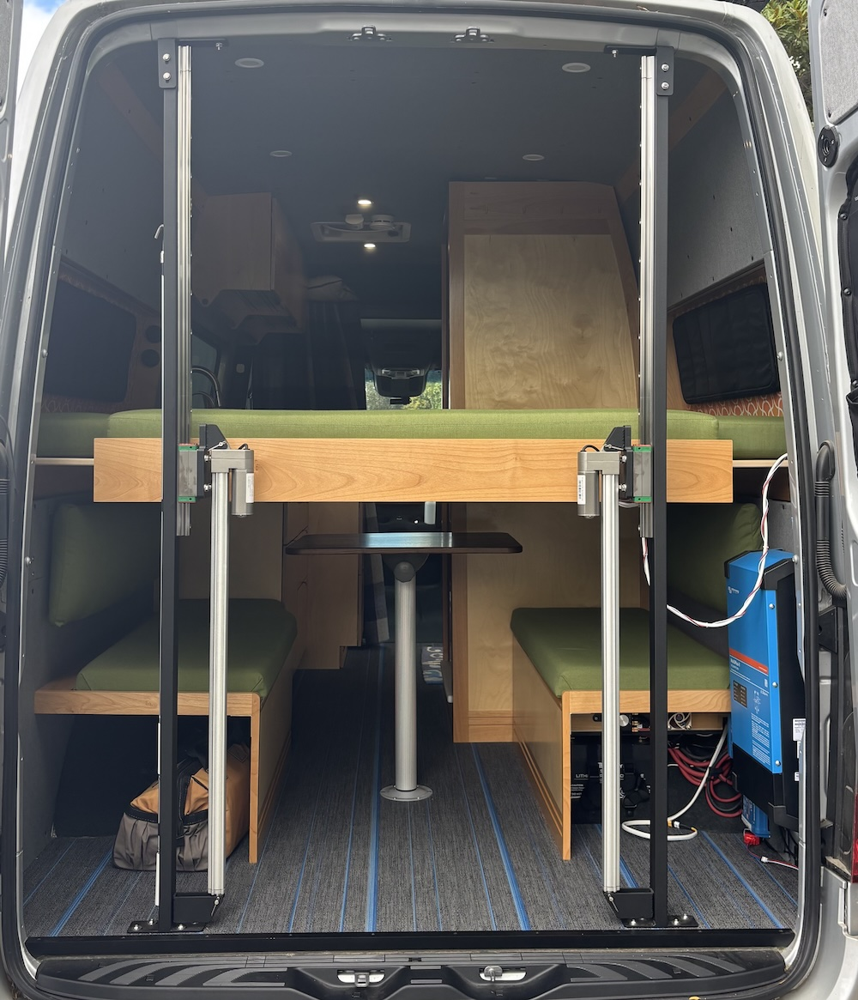
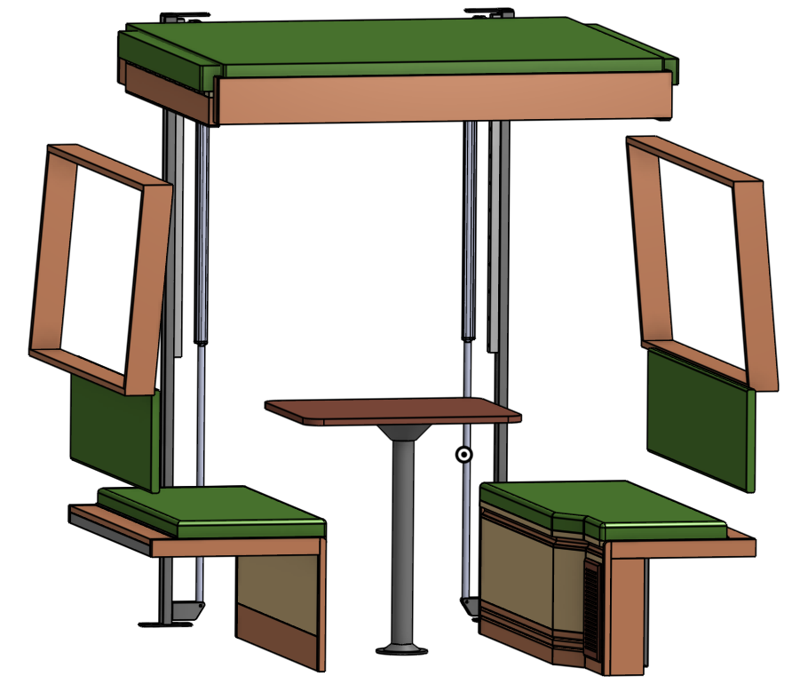

# Bed-lift controller

Controls a motorized bed-lift with two synchronized linear actuators for vertical lifting and lowering and two pairs of synchronized stepper motors for horizontal extension and retraction.  It fits in the back of a campervan.

## Circuit board revisions

Refer to the following documents for design synopsis, schematics, and circuit board illustrations.

- [v1](./hardware/v1/design-and-errata.md): Fixed errata, improved assignment of pin functions, added span limit hall sensors, buzzer and ESD protection
- [v0.2](./hardware/v0.2/design-and-errata.md): First feature-complete circuit board
- [v0.1](./hardware/v0.1/design-and-errata.md): Initial hand-assembled prototype

## About the "forklift" bed

This custom motorized bed fits in the back of a small campervan to allow dual-use of the living area in a standard wheelbase vehicle.  In its raised position, the bed platform is only supported from the back which gives it the appearance of a pallet on a forklift, hence the name.

To maximize space efficiency, the bed is designed for sleeping crosswise with the head and feet towards the sides of the vehicle.  This choice of sleeping orientation poses unique engineering challenges; it is more common to design lifting beds for sleeping lengthwise with the head and feet towards the front and back of the vehicle.

Because the van is narrower at roof elevantion than at sleeping elevation, the bed extends and retracts to span the gap between the main body of the bed platform and the sides of the vehicle.  The parts that extend and retract are called the bed wings (aka. wing spans).  The bed mattress is made of three cushions: one large central cushion on the main body of the bed platform and two narrower cushions that rest on the two bed wings.  The narrower cushions are removed and stowed on top of the bed before retracting the bed wings.

- When the bed is raised, the bed wings retract into the bed platform and the platform is cantilevered from steel columns attached to the rear doorframe and floor of the vehicle.

- When the bed is lowered, the bed wings extend from the bed platform and rest upon reinforced windowsills to transfer the load of the occupants to the vehicle walls.

The bed has limited load bearing capacity while raised so it must be lowered when occupied or while driving to prevent excess torque through the cantilever.  As an advantage, there are no cables, straps, bulkheads, guides, posts, or other obstructions in the front of the living area to support the bed.  As a disadvantage, the bed structure is heavy and difficult to build.

Feel free to contact me for advice if you are interested in building a bed like mine (and be prepared for a challenge)!

Photos

### Bed lift prototype in lowered position

### Bed lift prototype in raised position

CAD model

### Bed lift CAD model in lowered position

### Bed lift CAD model in raised position

## Notice

The bed-lift software, documentation, design, and all copyright protected artifacts are released under the terms of the [MIT license](LICENSE).

The bed-lift hardware is released under the terms of the [CERN-OHL-W license](hardware/LICENSE).
