# Bed-lift controller

Controls a motorized bed-lift with two synchronized linear actuators for vertical lifting and lowering and two pairs of synchronized stepper motors for horizontal extension and retraction.  It fits in the back of a campervan.

## Circuit board revisions

Refer to the following documents for design synopsis, schematics, and circuit board illustrations.

- [v1](./hardware/v1/design-and-errata.md): Fixed errata, improved assignment of pin functions, added span limit hall sensors, buzzer and ESD protection
- [v0.2](./hardware/v0.2/design-and-errata.md): First feature-complete circuit board
- [v0.1](./hardware/v0.1/design-and-errata.md): Initial hand-assembled prototype

## About the "forklift" bed

This custom motorized bed fits in the back of a small campervan to allow dual-use of the living area in a standard wheelbase vehicle.  In its raised position, the bed platform is only supported from the back which gives it the appearance of a pallet on a forklift, hence the name.

To maximize space efficiency, the bed is designed for sleeping crosswise with the head and feet towards the sides of the vehicle.  This choice of sleeping orientation poses unique engineering challenges; it is more common to design lifting beds for sleeping lengthwise with the head and feet towards the front and back of the vehicle.

Because the van is narrower at roof elevantion than at sleeping elevation, the bed extends and retracts to span the gap between the main body of the bed platform and the sides of the vehicle.  The parts that extend and retract are called the bed wings (aka. wing spans).  The bed mattress is made of three cushions: one large central cushion on the main body of the bed platform and two narrower cushions that rest on the two bed wings.  The narrower cushions are removed and stowed on top of the bed before retracting the bed wings.

- When the bed is raised, the bed wings retract into the bed platform and the platform is cantilevered from steel columns attached to the rear doorframe and floor of the vehicle.

- When the bed is lowered, the bed wings extend from the bed platform and rest upon reinforced windowsills to transfer the load of the occupants to the vehicle walls.

The bed has limited load bearing capacity while raised so it must be lowered when occupied or while driving to prevent excess torque through the cantilever.  As an advantage, there are no cables, straps, bulkheads, guides, posts, or other obstructions in the front of the living area to support the bed.  As a disadvantage, the bed structure is heavy and difficult to build.

Feel free to contact me for advice if you are interested in building a bed like mine (and be prepared for a challenge)!

[Video tour of the v0.2 prototype](https://vimeo.com/1154513482/b7c7d3c8f7)

<details>
<summary>Photos of v0.2 prototype</summary>

### Bed lift in lowered position viewed from outside
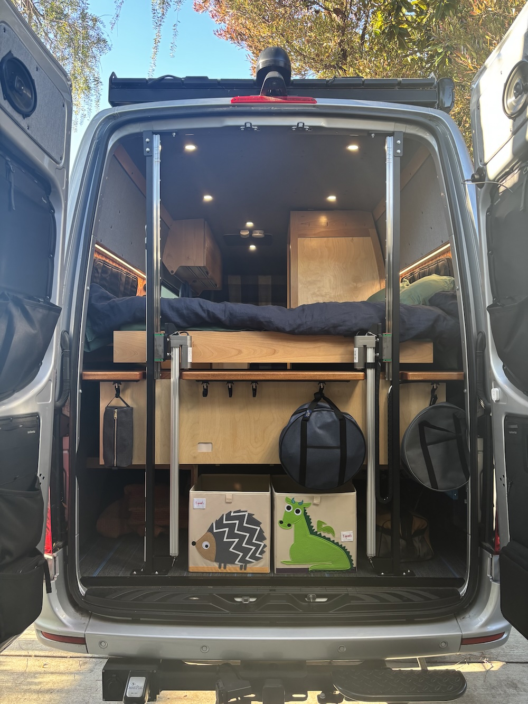

### Bed lift in raised position viewed from outside
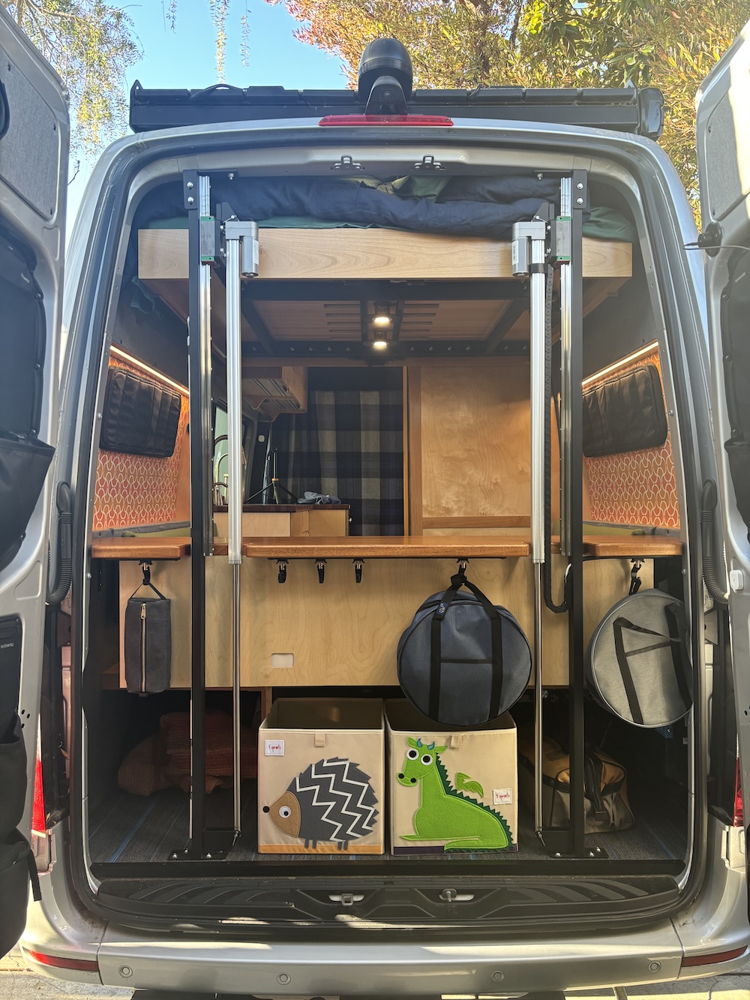

### Bed lift in lowered position viewed from inside
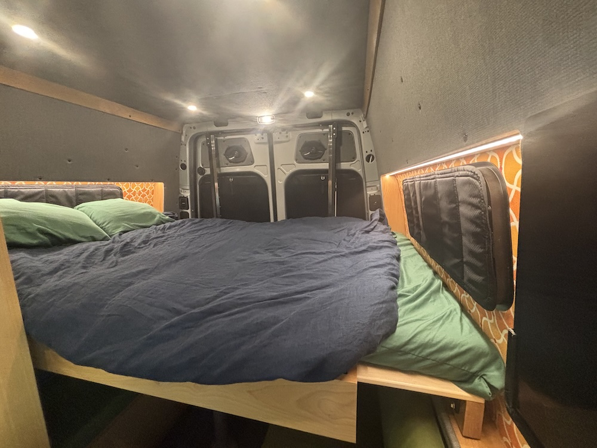

### Bed lift in raised position viewed from inside
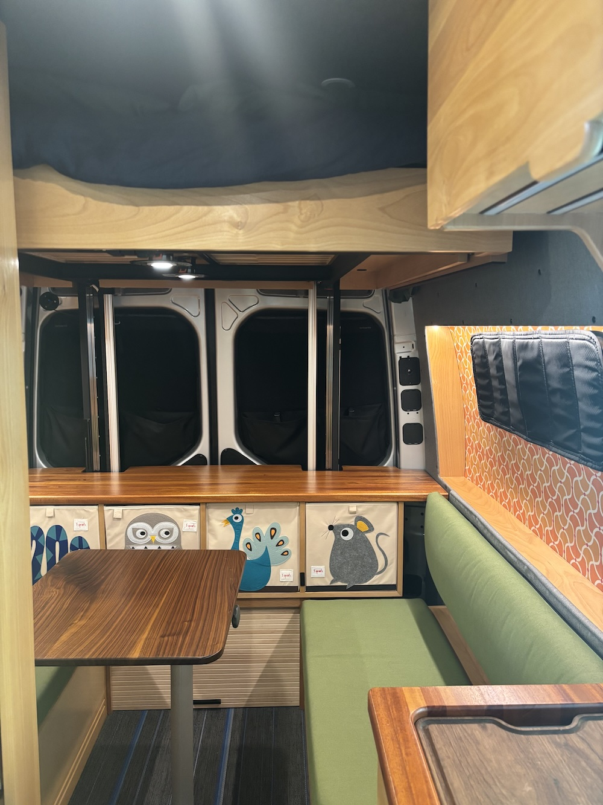

### Bed lift controls
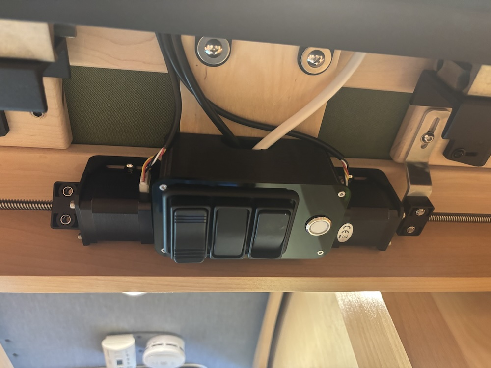

### Bed lift driver
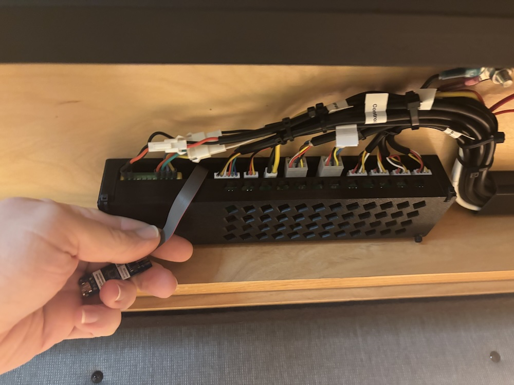

### Bed lift position encoder
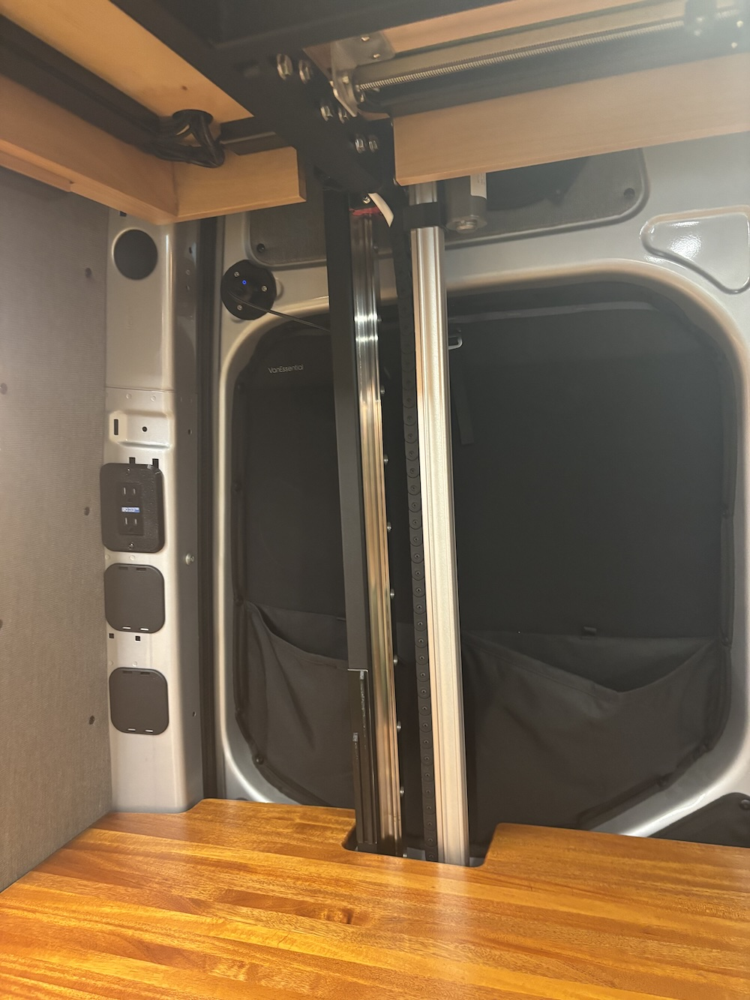

</details>

<details>
<summary>Photos of v0.1 prototype</summary>

### Bed lift in lowered position
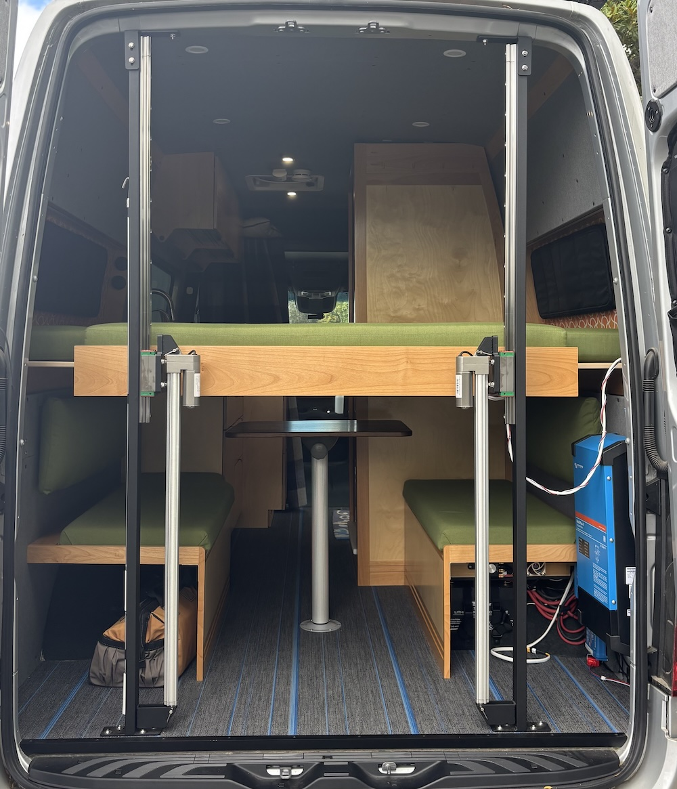

### Bed lift in raised position
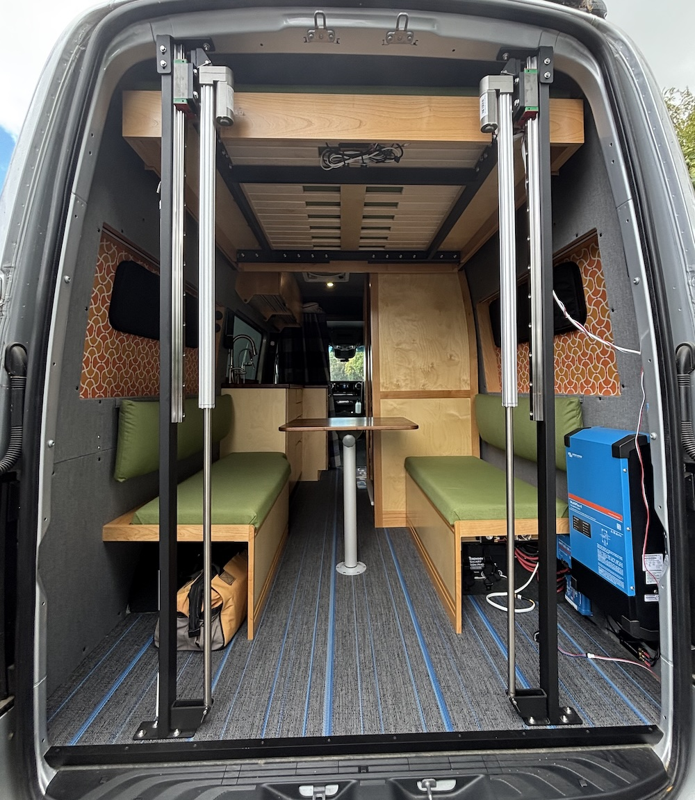

</details>

<details>
<summary>CAD model</summary>

### Bed lift in lowered position
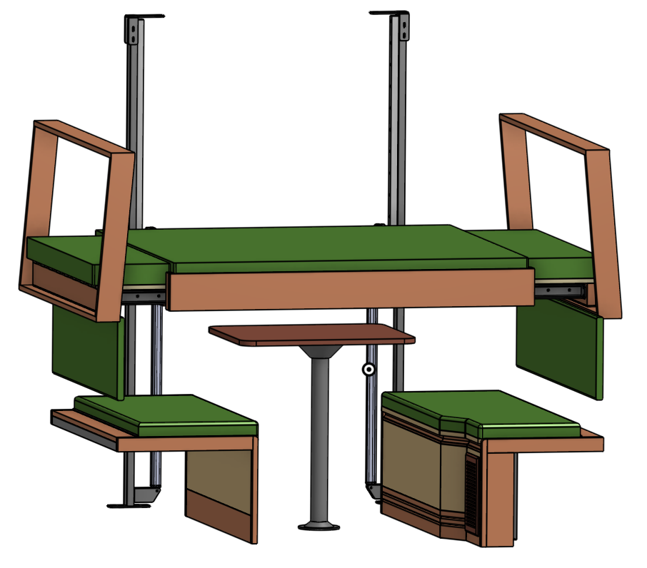

### Bed lift in raised position
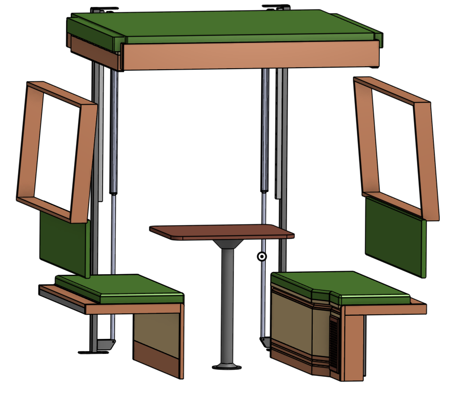

</details>

## How to build the firmware

The firmware is based on Zephyr RTOS v4.3 and compiled with `west`.

1. Install the Zephyr RTOS SDK tools.  You can either follow the [Zephyr Getting Started Guide](https://docs.zephyrproject.org/latest/develop/getting_started/index.html) or install an extension for your IDE, such as [Zephyr IDE](https://zephyr-ide.mylonics.com/) or [Workbench for Zephyr](https://z-workbench.com/), that can install the tools for you.

2. Install the [xPack OpenOCD](https://xpack-dev-tools.github.io/openocd-xpack/docs/install/) package for your OS and add it to your system `PATH`.  This step is needed because the version of OpenOCD that is distributed with Zephyr is too old and doesn't support the STM32C0x series of chips.  We need OpenOCD v0.12.0-7 at minimum.

3. Get the code and its dependencies.  This is a little more complicated than simply cloning this git repository because the Zephyr `west` multi-tool assumes that all of the code resides within a top directory called a workspace.  You will need to create an empty directory to be the workspace first.  Here's how to do it from the command-line and the same thing can be done with IDE extensions.

```sh
$ mkdir bed-lift-workspace
$ cd bed-lift-workspace
$ west init -m https://github.com/j9brown/bed-lift
$ west update
```

4. Build and the firmware (either release or debug).

```sh
$ cd bed-lift/firmware/app
$ west build -p -d build/release
$ west build -p -d build/debug -- -DFEATURE_LOG=y -DFEATURE_DEBUG=y
```

5. Connect an ST-Link v3 programmer to the `DEBUG` port with an `STDC14` cable.  Flash the firmware.

```sh
$ cd bed-lift/firmware/app
$ west flash
```

Firmware for the older prototypes is preserved in the git history.

- The v0.2 firmware was based on Zephyr RTOS v4.2.1 and compiled with Platform IO.
- The v0.1 firmware was based on Arduino and compiled with Platform IO.

## Usage

The lift control panel has three switches:

- `Power`: This on / off switch provides power to the lift driver and all actuators.  It is intended to remain on indefinitely.  Can be used to cut power in case of emergencies.
- `Up / Off / Down`: This momentary-on / off / momentary-on switch has two positions.  Toggling the switch to the `Up` position raises the lift to the lounge position.  Toggling the switch to the `Down` position lowers the lift to the sleeping position.  The switch must be held in the `Up` or `Down` position for 0.5 seconds to engage the actuators as a precaution against accidental triggering.  The lift stops moving immediately as soon as the switch is released and returns to the `Off` position.
- `Mode`: This momentary-on / off switch accesses diagnostic menus.  It is not intended to be used during normal operation.

By default, the lift starts on the `Main Menu` and the `Up / Off / Down` controls whether the lift moves into the lounge or sleep position.

To access a different menu, press and hold the `Mode` button for 0.5 seconds until the indicator lights `Amber` then blinks one or more times in a different color.  The second color indicates the menu and the number of blinks indicates the action that will be performed when the `Up / Off / Down` switch is activated.  Press the `Mode` button to cycle among actions and observe the number of blinks change.  Press an hold the `Mode` button for 0.5 seconds to access the next menu and observe the blink color change.  Refer to the table below to identify the currently selected menu action.

The lift reverts to an idle state when the user does not interact with the controls for some time.

### Visual feedback

An RGB color indicator shows the state of the device at the control panel.  There is also a monochromatic red LED on the circuit board itself that indicators the same state as the indicator (but without color).

- When the lift remains idle for some time, the indicator turns off.
- When the lift is rising, the indicator shows a rainbow color wheel cycling from red to violet.
- When the lift is lowering, the indicator shows a rainbow color wheel cycling from violet to red.
- When the lift achieves the lounge or sleep position, the indicator lights `Green`.
- When the lift movement is aborted without achieving the lounge or sleep position, the indicator lights `Amber`.
- When a diagnostic menu mode is active, the indicator lights `Amber` then blinks one or more times in a different color depending on the menu.
- When an error occurs, the indicator lights `Red` then blinks one or more times in a different color depending on the error.

| Solid color  | Blink color  | Blinks | Purpose  | Meaning |
| ------------ | ------------ | ------ | -------- | ------- |
| Rainbow up   |              |        | Activity | Lift is rising |
| Rainbow down |              |        | Activity | Lift is lowering |
| Green        |              |        | Status   | Lift is in lounge or sleep position, ready for use |
| Amber        |              |        | Status   | Lift is in an intermediate position, not ready for use |
| Amber        | Cyan         | 1      | Menu     | Lift menu: Jog both lift actuators in tandem (synchronized) |
| Amber        | Cyan         | 2      | Menu     | Lift menu: Jog both lift actuators indepedently (not synchronized) |
| Amber        | Cyan         | 3      | Menu     | Lift menu: Jog lift actuator 1 (driver side) |
| Amber        | Cyan         | 4      | Menu     | Lift menu: Jog lift actuator 2 (passenger side) |
| Amber        | Blue         | 1      | Menu     | Span menu: Jog all span actuators in tandem (synchronized) |
| Amber        | Blue         | 2      | Menu     | Span menu: Jog both span actuators 1 and 2 (driver side) in tandem (synchronized) |
| Amber        | Blue         | 3      | Menu     | Span menu: Jog both span actuators 3 and 4 (passenger side) in tandem (synchronized) |
| Amber        | Blue         | 4      | Menu     | Span menu: Jog both span actuator 1 (front driver side) independently (not synchronized) |
| Amber        | Blue         | 5      | Menu     | Span menu: Jog both span actuator 2 (rear driver side) independently (not synchronized) |
| Amber        | Blue         | 6      | Menu     | Span menu: Jog both span actuator 3 (front passenger side) independently (not synchronized) |
| Amber        | Blue         | 7      | Menu     | Span menu: Jog both span actuator 4 (rear passenger side) independently (not synchronized) |
| Red          |              |        | Error    | Error: An unspecified error occurred |
| Red          | Magenta      | 1      | Error    | Control error: Movement of the bed has been remotely inhibited |
| Red          | Amber        | 1      | Error    | Bed error: The bed components are in an unknown or unexpected state |
| Red          | Cyan         | 1      | Error    | Lift error: Motor driver reported a fault |
| Red          | Cyan         | 2      | Error    | Lift error: The actuators lost synchronization |
| Red          | Cyan         | 3      | Error    | Lift error: Lift stationary when it should be moving or the hall sensors are not working correctly |
| Red          | Cyan         | 1      | Error    | Lift error: I/O error communicating with the motor driver |
| Red          | Cyan         | 1      | Error    | Lift error: Operation timed out because poll wasn't called often enough |
| Red          | Blue         | 1      | Error    | Span error: Motor driver reported a fault |
| Red          | Blue         | 2      | Error    | Span error: The actuators lost synchronization |
| Red          | Blue         | 3      | Error    | Span error: The actuators did not stall at their home position as expected |
| Red          | Blue         | 4      | Error    | Span error: The actuators traveled further than the expected distance without stalling |
| Red          | Blue         | 5      | Error    | Span error: I/O error communicating with the motor driver |
| Red          | Blue         | 6      | Error    | Span error: Operation timed out because poll wasn't called often enough |

### Audible feedback

A piezo buzzer provides audible feedback.

- When the lift successfully raises into the lounge position, it plays a brief fanfare that ends on a rising tone.
- When the lift successfully lowers into the sleep position, it plays a brief fanfare that ends on a falling tone.
- When the lift encounters an error, it plays three long tones as an alert.
- When the user attempts to perform an action that has been remotely inhibited, the lift plays three quick tones.

### I2C interface

Connect an I2C host to the lift driver's `EXT I2C` port using a `QWIIC` connector to remotely monitor the device, remotely inhibit operation of the control panel, and access low-level debug and test features.  The `EXT I2C` port galvanically isolates the bed lift from the host's power supply for safety.

Refer to [monitor.c](./firmware/app/src/monitor.c) for the I2C protocol implementation.

## Notice

The bed-lift software, documentation, design, and all copyright protected artifacts are released under the terms of the [MIT license](LICENSE).

The bed-lift hardware is released under the terms of the [CERN-OHL-W license](hardware/LICENSE).
