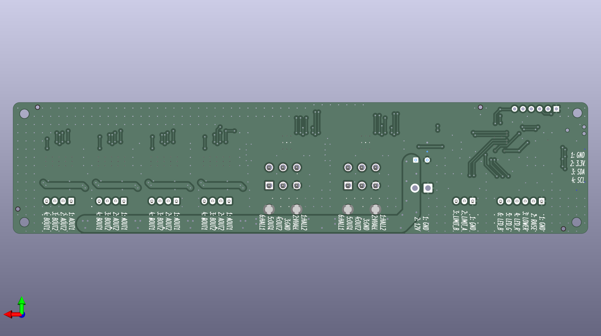

# Bed-lift controller

**Status: UNDER DEVELOPMENT**

Controls a motorized bed-lift with two synchronized linear actuators for vertical lifting and lowering and two pairs of synchronized stepper motors for horizontal expansion and contraction.

## Design synopsis

The controller has the following major components:

- A [STM32C031K6T6](https://www.st.com/resource/en/datasheet/stm32c031k6.pdf) controls the actuators. It is programmed with SWD using a [Tag-Connect 2030-NL](https://www.tag-connect.com/info) connector, UART, or I2C.
- A [ISO1640](https://www.ti.com/lit/ds/symlink/iso1640.pdf) isolates the I2C bus to prevent ground loops through the `QWIIC` connector because the driver has a separate power supply.
- Four [DRV8434S](https://www.ti.com/lit/ds/symlink/drv8434s.pdf) stepper motor drivers operate the four motors that expand and retract the side spans of the bed.
- Two [DRV8874](https://www.ti.com/lit/ds/slvsf66a/slvsf66a.pdf) motor drivers operate the two linear actuators that raise and lower the bed.

The MCU receives control inputs from a momentary rocker switch attached to the `CONTROL` input and it provides feedback on its progress to an RGB LED indicator.  It also receives control inputs and provides feedback over I2C to a host controller via the `QWIIC` connector.  It receives position feedback to synchronize the motors from the lift actuator hall sensors, lift `LIMIT` switches, and stepper motor driver stall detection.

The circuit board requires a 12 V DC nominal supply protected by a 10 A external fuse. If that isn't enough current, the it should be safe to operate the board at up to 15 A with a limited duty cycle of a few minutes.

The schematics include the BOM and metadata for the JLCPCB fabrication toolkit plug-in.

## Illustrations

[Schematics PDF](./hardware/v0.2/bed-lift.pdf)

PCB front and back

### PCB front

### PCB back

Bed lift mechanism

### Bed lift in lowered position

### Bed lift in raised position

## Errata

Nothing yet...

## Notice

The bed-lift software, documentation, design, and all copyright protected artifacts are released under the terms of the [MIT license](LICENSE).

The bed-lift hardware is released under the terms of the [CERN-OHL-W license](hardware/LICENSE).
