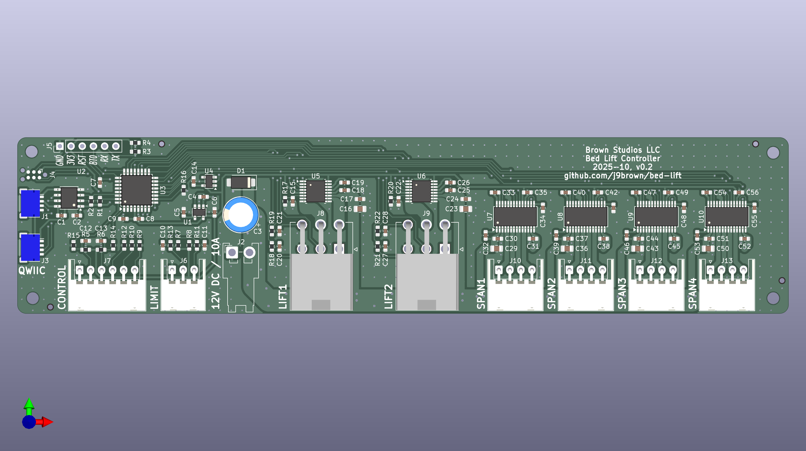
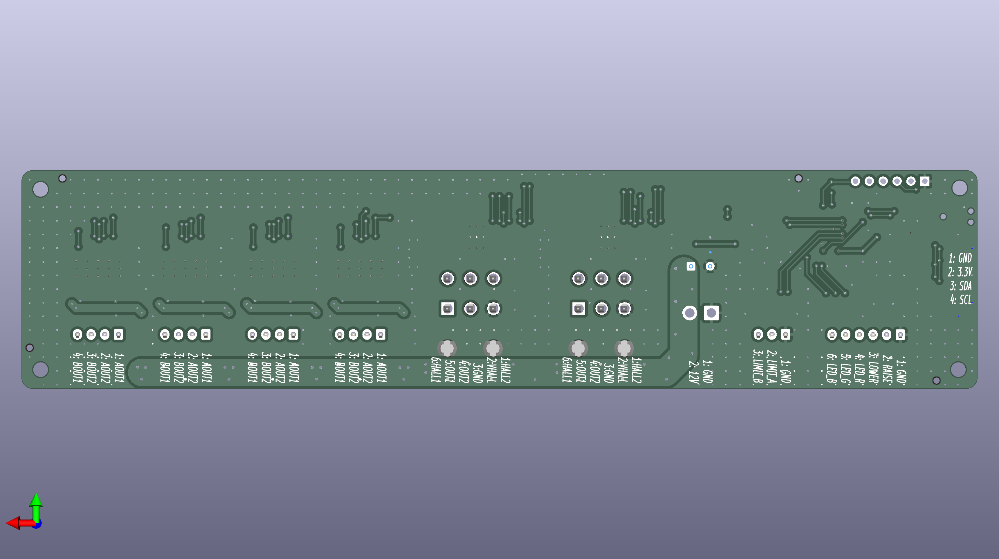

# Bed lift v0.2 (OBSOLETE)

**Status: Superseded by v0.3, see [errata](#errata)**

## Design synopsis

The controller has the following major components:

- A [STM32C031K6T6](https://www.st.com/resource/en/datasheet/stm32c031k6.pdf) controls the actuators. It is programmed with SWD using a [Tag-Connect 2030-NL](https://www.tag-connect.com/info) connector, UART, or I2C.
- A [ISO1640](https://www.ti.com/lit/ds/symlink/iso1640.pdf) isolates the I2C bus to prevent ground loops through the `QWIIC` connector because the driver has a separate power supply.
- Four [DRV8434S](https://www.ti.com/lit/ds/symlink/drv8434s.pdf) stepper motor drivers operate the four motors that extend and retract the side spans of the bed.
- Two [DRV8874](https://www.ti.com/lit/ds/slvsf66a/slvsf66a.pdf) motor drivers operate the two linear actuators that raise and lower the bed.

The MCU receives control inputs from a momentary rocker switch attached to the `CONTROL` input and it provides feedback on its progress to an RGB LED indicator.  It also receives control inputs and provides feedback over I2C to a host controller via the `QWIIC` connector.  It receives position feedback to synchronize the motors from the lift actuator hall sensors, lift `LIMIT` switches, and stepper motor driver stall detection.

The circuit board requires a 12 V DC nominal supply protected by a 10 A external fuse. If that isn't enough current, the it should be safe to operate the board at up to 15 A with a limited duty cycle of a few minutes.

The schematics include the BOM and metadata for the JLCPCB fabrication toolkit plug-in.

## Illustrations

[Schematics PDF](bed-lift.pdf)

PCB front and back

### PCB front

### PCB back

## Errata

Be advised that this version of the circuit board contains errors that must be corrected for correct operation.

The lift motor connector pins 2 and 3 are swapped which reverses the polarity of the power supply to the hall sensors.

  - Workaround: Release the terminals with the red and black wires from the motor connector and swap them.  Add a label to the motor cable to indicate that this was done so the change can be reverted when the errata is corrected.

The DRV8434S must observe a high-to-low transition of nSCS to being an SPI transaction.  Unfortunately nSCS was tied to ground because it was believed no chip select was needed due to the absence of other devices on the SPI bus.

  - Workaround: Detach nSCS (pin 18) from each DRV8434S, bend it away from the PCB, solder jumpers to PC14 (pin 2) of the microcontroller.  Note that the pad underneath pin 18 is tied to ground underneath the chip so cutting the trace is not an option (unless the whole chip is removed).

## Changes since v0.1

Designed a feature-complete circuit board.
