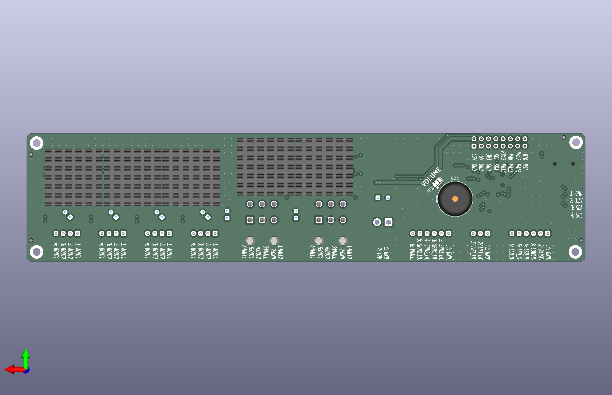

# Bed lift v1.0

**Status: Ready for fabrication, not yet tested**

## Design synopsis

The controller has the following major components:

- A [STM32C051C8T6](https://www.st.com/resource/en/datasheet/stm32c051c8.pdf) with 64 KB flash and 12 KB RAM controls the actuators. It is programmed with SWD using a STDC14 connector. The timer peripherals are used extensively for motor control and feedback.
- A [ISO1640](https://www.ti.com/lit/ds/symlink/iso1640.pdf) isolates the I2C bus to prevent ground loops through the `QWIIC` connector because the driver has a separate power supply.
- Four [DRV8434S](https://www.ti.com/lit/ds/symlink/drv8434s.pdf) stepper motor drivers operate the four motors that extend and retract the side spans of the bed.
- Two [DRV8874](https://www.ti.com/lit/ds/slvsf66a/slvsf66a.pdf) motor drivers operate the two linear actuators that raise and lower the bed.

The device receives end-user control inputs from a momentary rocker switch attached to the `CONTROL` input and it provides feedback on its progress with an RGB LED indicator and piezo buzzer. To synchronize the motors and move the bed lift into the correct pose, the device receives position feedback from the `LIFT` actuator hall sensors, `LIFT LIMIT` switches, `SPAN LIMIT` hall sensors, and stepper motor driver stall detection. It can also be monitored and controlled remotely by an external I2C host via the `QWIIC` connector.

The circuit board requires a 12 V DC nominal supply protected by a 10 A external fuse.

The schematics include the BOM and metadata for the JLCPCB fabrication toolkit plug-in.

## Illustrations

[Schematics PDF](bed-lift.pdf)

PCB front and back

### PCB front

### PCB back

## Additional materials

Control panel switches

  - 3 gang switch panel mount
    - Carling Technologies VM3-01
  - Up/down control
    - Carling Technologies V8D2S001-00000-000 Contura momentary on/off/on rocker switch
    - Carling Technologies VVJZZ00-000 Contura XII paddle actuator
  - Mode control
    - Carling Technologies V2D2S001-00000-000 Contura momentary on/off rocker switch
    - Carling Technologies VV6ZZ00-000 Contura XI recessed actuator
  - Arm/disarm control
    - Carling Technologies V1D2S001-00000-000 Contura maintained on/off rocker switch
    - Carling Technologies VV1ZZ00-000 Contura X raised actuator
  - Generic small signal diodes to connect the mode switch to both up/down inputs

Control panel indicators

  - 3 V RGB panel indicator
    - Dialight 6251121307F or 6201121117F

Lift position encoders

  - 2 generic normally open lever arm micro limit switches with rollers

Span position encoders

  - 4 Littelfuse 55100-3M-02-A

Heat sinks

  - 5 generic 20 mm L x 20 mm W x 10 mm H self-adhesive heatsinks mounted on back side underneath the motor drivers

Actuators

  - 2 [Progressive Automation PA-09-03-30](https://www.progressiveautomations.com/products/mini-medium-force-linear-actuator) linear actuators for the lift, rated for 4 A at maximum 330 lbs load
  - 4 [Stepper Online 17E19S1684MB4-300RS](https://www.omc-stepperonline.com/nema-17-external-acme-linear-stepper-motor-1-68a-48mm-stack-screw-lead-8mm-0-31496-lead-length-300mm-17e19s1684mb4-300rs) stepper motors for the spans, rated for 1.68 A per phase

## Lift position encoders

Install two limit switches on the bed frame.  Each limit switch has a lever arm that is depressed when it rolls over a raised 3D printed plastic strip attached to the face of one of the bed lift columns.  Together the limit switches encode the position of the bed.

| State | Position                  | `Limit A` | `Limit B` | Wing action          |
| ----- | ------------------------- | --------- | --------- | -------------------- |
| `1`   | Maximum elevation         | `ON`      | `OFF`     | Fully retracted      |
| `2`   | Above safe zone           | `OFF`     | `OFF`     | Fully retracted      |
| `3`   | Within safe zone          | `OFF`     | `ON`      | Extending/retracting |
| `4`   | Below safe zone           | `ON`      | `ON`      | Fully extended       |

To raise the bed...

  - state `4`: raise platform
  - state `3`: retract wings then raise platform (can do both simultaneously)
  - state `2`: retract wings then raise platform
  - state `1`:
    - if full range of travel permitted (no cushions or other bulky materials stored on the bed) then raise platform until end-of-travel
    - otherwise stop

To lower the bed...

  - state `1`: lower platform
  - state `2`: lower platform
  - state `3`: extend wings then lower platform (can do both simultaneously)
  - state `4`:
    - if wings fully extended then lower platform until end-of-travel
    - otherwise: raise platform until state `3` achieved and the wings can be extended

## Span hall sensors

Install one hall sensor at each of the end-of-travel of the rear span actuators on both sides for a total of 4 sensors.

Although end-of-travel can be determined by observing stepper motor stalls, the motor can stall in mid-travel when it encounters sufficient resistance.  The span limit switches let the lift confirm the position before continuing the movement to the next pose.

## Pin function map

### Debug

- NRST on PF2: Reset
- SWDIO on PA13: SWDIO, serial wire data
- SWCLK/BOOT0 on PA14: SWCLK/BOOT0, serial wire clock

### Console

- USART1_TX on PA9: CONSOLE_TX, serial TX
- USART1_RX on PA10: CONSOLE_RX, serial RX

### External I2C bus (receives commands as target)

- I2C1_SCL on PB6: EXT_I2C_SCL, serial clock
- I2C1_SDA on PB7: EXT_I2C_SDA, serial data 

### Internal I2C bus (reserved for use as controller)

- I2C2_SCL on PB10: INT_I2C_SCL, serial clock
- I2C2_SDA on PB11: INT_I2C_SDA, serial data 

### SPI bus

- SPI1_NSS on PA4: SPAN_SCS, serial chip select
- SPI1_SCK on PA5: SPAN_SCLK, serial clock
- SPI1_MISO on PA6: SPAN_SDI, serial data in
- SPI1_MOSI on PA7: SPAN_SDO, serial data out

### Lift actuators

#### Driver interface

- TIM1_CH1 on PA0: LIFT1_IN1, PWM output
- TIM1_CH2 on PA1: LIFT1_IN2, PWM output
- TIM1_CH3 on PA2: LIFT2_IN1, PWM output
- TIM1_CH4 on PA3: LIFT2_IN2, PWM output
- TIM1_BKIN2 on PC14: LIFT_FAULT, trigger TIM1 break input 2
- GPIO on PC13: LIFT_SLEEP

The TIM1 break function prevents runaway motor operation when triggered by a system fault, debug mode, or TIM1_BKIN2 active.  Configured to stop both lift actuators when either one encounters a fault.

- DBG_TIM1_STOP freezes the counter during debugging.
- TIM1_BDTR:OSSI=1 forces outputs to inactive state on break.

#### Rotary encoders (digital hall sensors)

- GPIO on PB0 (EXTI0): LIFT1_HALL1, interrupt input
- GPIO on PB1 (EXTI1): LIFT1_HALL2, interrupt input
- GPIO on PB2 (EXTI2): LIFT2_HALL1, interrupt input
- GPIO on PB3 (EXTI3): LIFT2_HALL2, interrupt input

Quadrature decoding triggered by EXTI0-1 and EXTI2-3 interrupt with high-priority and not shared with any other I/O pins. We could have used TIM2 and TIM3 to decode both quadrature signals but we need one of those peripherals for the indicator PWM.

#### Position encoders (limit switches)

- GPIO on PF0: LIFT_LIMIT_A
- GPIO on PF1: LIFT_LIMIT_B

### Span actuators

#### Driver interface

- GPIO on PB4: SPAN_SLEEP
- GPIO (or TIM16_BKIN) on PB5: SPAN_FAULT
- TIM16_CH1 on PB8: SPAN_STEP

The drivers are connected to the SPI bus in a daisy-chain. All drivers receive the same step pulse and the direction is specified via SPI.

The TIM16 break function prevents runaway motor operation when triggered by a system fault or debug mode.  Optionally could be configured to stop all span actuators on faults (although this hasn't been needed yet).

- DBG_TIM16_STOP freezes the counter during debugging.
- TIM16_BDTR:OSSI=1 forces outputs to inactive state on break.

#### Position encoders (digital hall sensors)

- GPIO on PD0: SPAN1_LIMIT_A
- GPIO on PD1: SPAN1_LIMIT_B
- GPIO on PD2: SPAN2_LIMIT_A
- GPIO on PD3: SPAN2_LIMIT_B

### Indicator LEDs

- TIM3_CH1 on PC6: LED_R, PWM output
- TIM3_CH2 on PC7: LED_G, PWM output
- TIM3_CH3 on PC15: LED_B, PWM output
- TIM3_CH4 on PA8: EXP_PA8, PWM output

### Control buttons

- GPIO on PB14 (EXTI14): CTRL_LOWER, interrupt input
- GPIO on PB15 (EXTI15): CTRL_RAISE, interrupt input

### 5 V LDO for hall sensors

- GPIO on PF3: 5V_EN

The lift hall sensors require 5 V and do not operate reliably on 3.3 V.

The span hall sensors operate on 2.7 V to 24 V.  Use the 5 V LDO instead of 3.3 V so they can be easily turned off to save power together with the lift hall sensors.

### Buzzer

- TIM17_CH1 on PB9: BUZZ

### Unused pins available for expansion

- PA8 (TIM3_CH4, TIM14_CH1, USART2_TX)
- PA11 (ADC_IN11)
- PA12 (ADC_IN12)
- PA15 (TIM2_CH1, USART2_RX)
- PB12 (ADC_IN22, TIM1_BKIN)
- PB13 (---)

### [System bootloader](https://www.st.com/resource/en/application_note/an2606-stm32-microcontroller-system-memory-boot-mode-stmicroelectronics.pdf) configured pins

- Can access system bootloader via the console and external I2C ports
- Inputs: PA2, PA9
- Pull-up outputs: PA3, PA10, PB6, PB7, PB10, PB11
- Pull-down outpus: PA4, PA5, PA6, PA7, PB12, PB13, PB14, PB15

## Errata

None yet...

## Updates

### Major changes since v0.2

- Use an MCU variant with more pins and flash, expose unused pins to an expansion port, use STDC14 connector for debugging instead of TagConnect.
- Assign PWM capable outputs to motor driver inputs, drive the step signal with PWM, attach fault signals to break inputs.
- Correct the lift motor connector pins, provide 5 V for its hall sensors, attach hall sensor signals to EXTI0-4 lines for higher priority interrupt handling.
- Drive DRV8434S VREF with 3.3 V as recommended in the datasheet and provide missing SPI SCS signal.
- Improve switch input debouncing and add ESD protection.
- Add span limit hall sensor inputs to verify end-of-travel.
- Add a buzzer to warn of problems.
- Place additional bulk capacitance closer to every motor driver to distribute the switching current more evenly taking into account DC bias derating for the MLCC capacitors.
- Increase physical dimensions to allow for additional connectors and larger heat sinks. Keep the B.Cu plane mostly contiguous under the motor drivers to improve heat dissipation by moving the signals to In2.Cu in that location.
- Use plated mounting holes in each corner to prevent shorting to the 12 V zone.
- Avoid burying fixed voltage signals under chips in case they need to be bodged like last time.

### Remarks

- Considered replacing the 3.3 V LDO with a buck converter but the idle current is already so low (should be less than 5 mA) that it's not worth the complexity.
- The RC filter for the lift hall sensors does not appear to be strictly necessary but seems prudent given prior observations of sensor noise (which appears to have been resolved by increasing the supply to 5 V).
- The extra bulk capacitance may increase leakage current. If it becomes a problem, some capacitors can always be removed.
